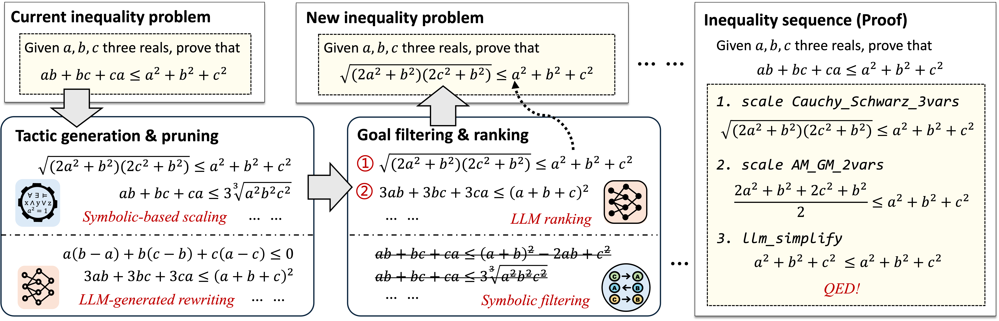

# Proving Olympiad Inequalities by Synergizing LLMs and Symbolic Reasoning

This is the official code for NeqLIPS, a powerful Olympiad Inequalities Prover.



NeqLIPS first enumerates all possible scaling tactics using symbolic tools, and prompts LLMs to generate rewriting tactics. 
Then, it selects the best proof state by symbolic filtering and neural ranking.

## Quick Start

#### 1. Clone the repository

```
git clone https://github.com/Lizn-zn/NeqLIPS.git 
cd NeqLIPS
```

#### 2. Install Lean 4 & Lean-REPL

Follow the instructions on the [Lean installation page](https://lean-lang.org/lean4/doc/setup.html) to install Lean 4. Then, install lean-repl via the following command.

```
git submodule init && git submodule update 
```

#### 2. Install dependencies

```
conda env create -f ./Installation/env.yml \
    && conda activate NeqLIPS && pip install git+https://github.com/Lizn-zn/pysmt.git@Bottema \
    && pip install --force-reinstall git+https://github.com/Lizn-zn/MT-Solver.git
```

#### 3. Install Rust & Egg

Follow the instructions on the [Rust installation page](https://www.rust-lang.org/tools/install) to install Rust. Then, install Egg via the following command.
```
cargo install maturin && maturin develop --release --manifest-path LIPS/egg_matching/Cargo.toml
```

#### 4. Install Symbolic Solver (Optional)

We strongly recommend installing one of the [maple](https://www.maplesoft.com/) or [mathematica](https://www.wolfram.com/mathematica/) for the counterexample checking

#### 5. Initialize the LLM interface

Set your own GPT interface in `./NeSyCore/llm.py`

#### 4. Run the Inequality Prover

Use the shell `run.sh` or the following command

```shell
python main.py --problem "theorem P1 {a b c : ℝ} : a * b + b * c + c * a ≤ a ^ 2 + b ^ 2 + c ^ 2 := by := by sorry"
```

Please refer to `LIPS/args.py` for more arguments.

## Proof Visualization


## Include more tactics

## Results

The generated formal proof are provided in `Neq/Math/Problem`, 


## TODO List

- [ ] README in `./Installation`
- [ ] Visualization of Proof Tree
- [ ] Alternative LLM DeepSeek instead of GPT-4
- [ ] Automation for rewrite tactics
- [ ] Convert SOS proof into Lean 4

## Questions and Bugs

To report a potential bug, please open an issue.

## License

This code repository is licensed under the MIT License.

## Citation

